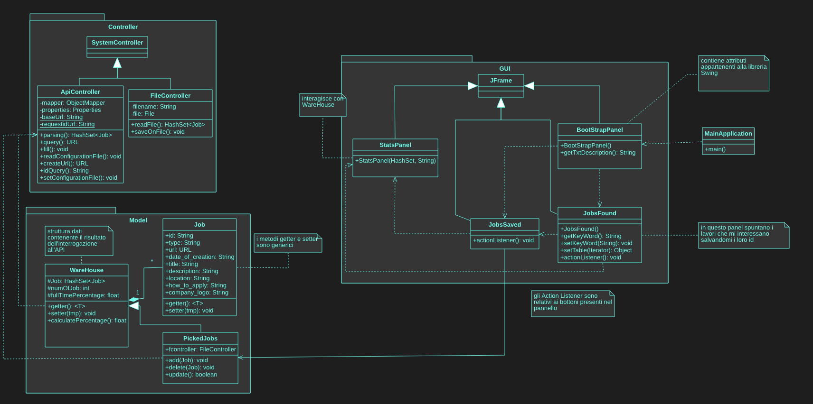
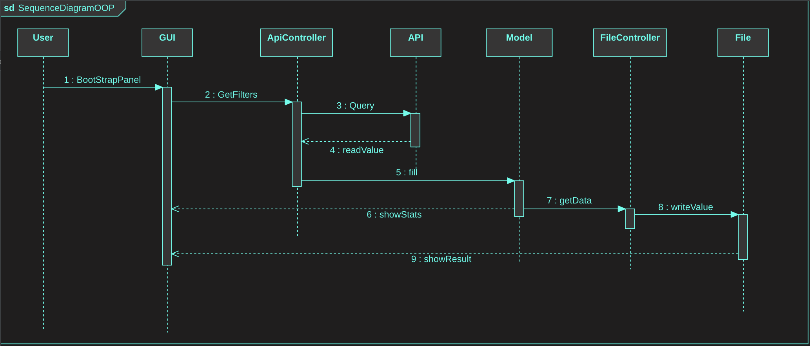

# Progetto JOBS GITHUB

L'obbiettivo del progetto è quello di creare un applicazione che permetta all'utente di monitorare 
offerte di lavoro e su tali offerte generare delle statistiche.

## L'Applicazione
E' possibile utilzzare l'applicazione:
+ tramite l'eseguibile
+ tramite un IDE

L'Applicazione nasce con l'idea di rendere il più semplice possibile la ricerca, da parte di un utente, di offerte di lavoro.
L'API [GitHub Jobs](https://jobs.github.com/api) consente di cercare lavori con JSON.
L'offerta di lavoro generica restituita dall'API ha la seguente forma:

---

Attraverso dei filtri abbiamo la possibilità di scegliere solo la catecoria che ci interessa. I possibili filtri sono i seguenti:
>+ **Description**: un termine contenuto all'interno della descrizione dell'offerta.
>+ **Location**: città in cui siamo intenzionati a fare la ricerca delle offerte.
>+ **Latitudine** e **Longitudine**: utilizzabili in sostituzinone alla località a patto che vengano utilizzati entrambi.
>+ **Full Time**: per limitari i risultati a solo offerte di lavoro full time.

Per rendere il più astratto possibile l'inserimento dei filtri da applicare alla ricerca abbiamo realizzato una GUI.

## UML
In prima istanza abbiamo realizzato dei Diagrammi UML per modellare il funzionamento 
della nostra Applicazione.
+ **Use-Case Diagram**
> 

+ **Class Diagram**
> 

+ **Sequence Diagram**
> 
Sarà presente anche un file di configurazione contenente gli URL per effettuare le chiamte all'API.
In questo modo nell'eventualità che venga cambiato l'URL dell'API basterà cambiarlo nel file configurazione senza intervenire direttamente sul programma.

## Developers

| **Autori**  | **Email**| **GitHub**  | **Contributo**  | LinkedIn |
|---|---|---|---|---|
|  Chiara Gobbi | <s1093786@studenti.univpm.it> |  [chiaragii](https://github.com/chiaragii) | %   | https://www.linkedin.com/in/chiara-gobbi-1900931bb  |
|  Daniele Benfatto |<s1092454@studenti.univpm.it>   | [benFactotum99](https://github.com/benFactotum99)  |   % |  <https://www.linkedin.com/in/daniele-benfatto-247830201> |
|  Davide De Zuane | <davide@girori.net>  |  [DavideDeZuane](https://github.com/DavideDeZuane) | %  |  <https://www.linkedin.com/in/davide-de-zuane-021372201> |
