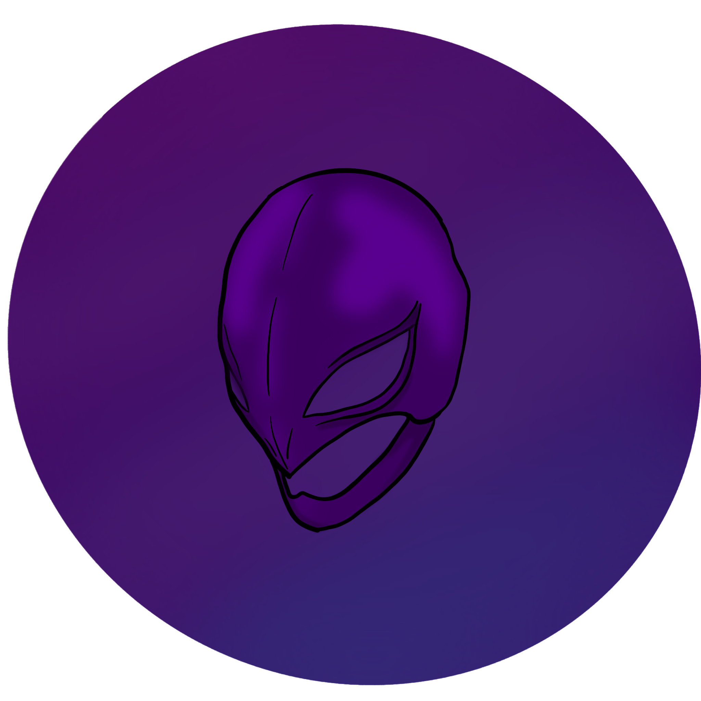
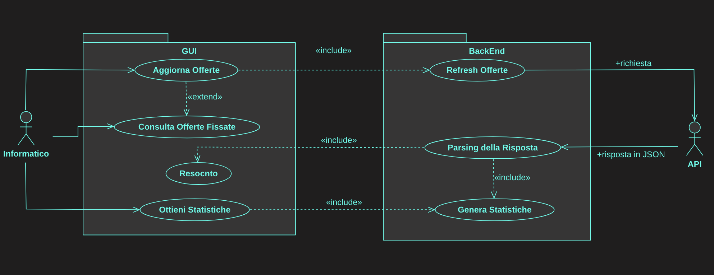
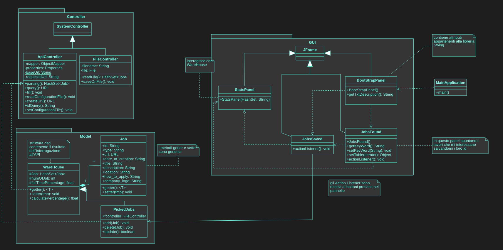
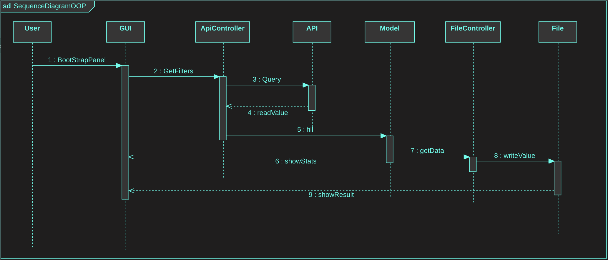

<p align="center">

</p>

# Progetto JOBS GITHUB

L'obbiettivo del progetto è quello di creare un applicazione che permetta all'utente di monitorare 
offerte di lavoro e su tali offerte generare delle statistiche.

## L'Applicazione
L'API [GitHub Jobs](https://jobs.github.com/api) consente di cercare lavori in formato JSON, dove ad ogni **`chiave`** è associato un **`valore`**.
L'offerta di lavoro generica restituita dall'API ha la seguente forma:
```json
{
    "id" : "b1691d49-ee1d-4793-9c1d-7a10a9b8b84a",
    "type" : "Full Time",
    "url" : "https://jobs.github.com/positions/b1691d49-ee1d-4793-9c1d-7a10a9b8b84a",
    "created_at" : "Mon Dec 07 19:23:19 UTC 2020",
    "company" : "EME Hive",
    "company_url" : "http://emehive.co",
    "location" : "New York City",
    "title" : "Infrastructure Engineer for Social Livestreaming App",
    "description" : "<p>...</p>\n",
    "how_to_apply" : "<p>...</p>\n",
    "company_logo" : "https://....png"
}
```
Attraverso dei filtri abbiamo la possibilità di scegliere solo la categoria che ci interessa. I possibili filtri sono i seguenti:
>+ **Description**: un termine contenuto all'interno della descrizione dell'offerta.
>+ **Location**: città in cui siamo intenzionati a fare la ricerca delle offerte.
>+ **Latitudine** e **Longitudine**: utilizzabili in sostituzinone alla località a patto che vengano utilizzati entrambi.
>+ **Full Time**: per limitari i risultati a solo offerte di lavoro full time.

Tali filtri vanno inseriti con una certa sintassi all'interno della richiesta; un esempio è il seguente:
> https://jobs.github.com/positions.json?description=python&full_time=true&location=sf

Per un utente medio risulta difficoltoso riuscire a compilare una richiesta simile e leggerne il risultato. 
Per ovviere a questo problema abbiamo pensato di integrare nel nostro programma:
+ **Frontend**: un interfaccia che permetta all'utente di inserire facilmente i filtri da applicare alla ricerca;
+ **Backend**: un insieme di classi e strutture dati che permettono all'utente di visualizzare, in un formato a cui è abituato, il risultato della ricerca.


## UML
In prima istanza abbiamo realizzato dei Diagrammi UML per modellare il funzionamento 
della nostra Applicazione.

 + **Use-Case Diagram**

> 

Brevemente:
+ l'utente si interfaccia e interagiste con il frontend (un insieme di panelli della GUI) 
+ il risultato delle iterazione viene passato al backend che effettua richieste
     + interroga l'API fornita
     + ne elabora le risposte 
     + presenta il risultato dell'elelaborazione all'utente, offrendo alcune funzionalità come statistiche e salvare lavori.

---

+ **Class Diagram**

> 

---

+ **Sequence Diagram** 
> 

Sarà presente anche un file di configurazione contenente gli URL per effettuare le chiamte all'API.
In questo modo nell'eventualità che venga cambiato l'URL dell'API basterà cambiarlo nel file configurazione senza intervenire direttamente sul programma.

---

Questi diagrammi sono abbastanza lontani dalla realizzazione finale del progetto; questo perchè durante la fase di sviluppo siamo andati incontro
a limitazioni e ad aggiunte di funzionalità che hanno modificato le relazioni definite inizalmente.


## FrameWork
I prinicipali framework utilizzati per la realizzazione dell'applicazione sono i seguenti:
+ [Swing](https://docs.oracle.com/javase/7/docs/api/javax/swing/package-summary.html) 
+ [Jackson JSON](https://github.com/FasterXML/jackson/wiki/Jackson-Release-2.12)
+ [Jsoup](https://jsoup.org)
+ [JFreeChart](https://sourceforge.net/projects/jfreechart/files/1.%20JFreeChart/1.0.19/)


## Funzionamento
Appena avviatà l'applicazione l'utente troverà la seguente finestra:


## Developers

| **Autori**  | **Email**| **GitHub**  | **Contributo**  | LinkedIn |
|---|---|---|---|---|
|  Chiara Gobbi | <s1093786@studenti.univpm.it> |  [chiaragii](https://github.com/chiaragii) | %   | https://www.linkedin.com/in/chiara-gobbi-1900931bb  |
|  Daniele Benfatto |<s1092454@studenti.univpm.it>   | [benFactotum99](https://github.com/benFactotum99)  |   % |  <https://www.linkedin.com/in/daniele-benfatto-247830201> |
|  Davide De Zuane | <davide@girori.net>  |  [DavideDeZuane](https://github.com/DavideDeZuane) | %  |  <https://www.linkedin.com/in/davide-de-zuane-021372201> |
