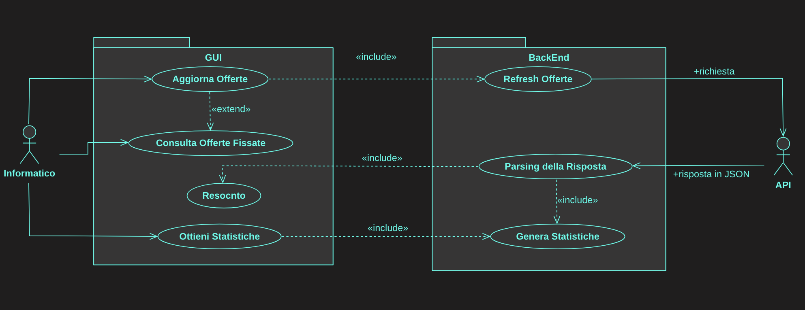

# Progetto JOBS GITHUB

L'obbiettivo del progetto è quello di creare un applicazione che permetta all'utente di monitorare 
offerte di lavoro e su tali offerte generare delle statistiche.

## L'Applicazione
E' possibile utilzzare l'applicazione:
+ tramite l'eseguibile
+ trmite un IDE

## UML
In prima istanza abbiamo realizzato dei Diagrammi UML per modellare il funzionamento 
della nostra Applicazione.
+ **Use-Case Diagram**

+ **Class Diagram**

+ **Sequence Diagram**

##Autori
+ [Chiara Gobbi]()
+ [Daniele Benfatto]()
+ [Davide De Zuane](https://github.com/DavideDeZuane)

