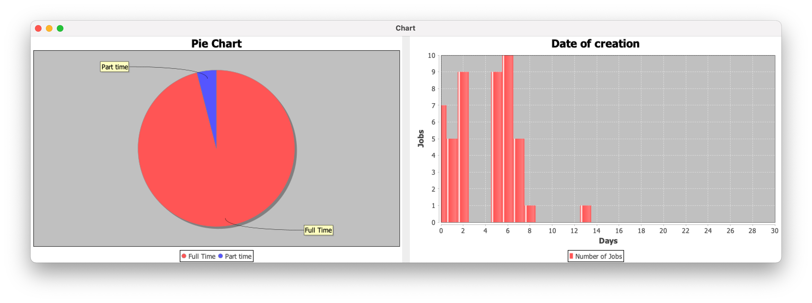

<p align="center">

</p>

# Progetto JOBS GITHUB

L'obbiettivo del progetto è quello di creare un applicazione che permetta all'utente di monitorare 
offerte di lavoro e su tali offerte generare delle statistiche.

## L'Applicazione
L'API [GitHub Jobs](https://jobs.github.com/api) consente di cercare lavori in formato JSON, dove ad ogni **`chiave`** è associato un **`valore`**.
L'offerta di lavoro generica restituita dall'API ha la seguente forma:
```json
{
    "id" : "b1691d49-ee1d-4793-9c1d-7a10a9b8b84a",
    "type" : "Full Time",
    "url" : "https://jobs.github.com/positions/b1691d49-ee1d-4793-9c1d-7a10a9b8b84a",
    "created_at" : "Mon Dec 07 19:23:19 UTC 2020",
    "company" : "EME Hive",
    "company_url" : "http://emehive.co",
    "location" : "New York City",
    "title" : "Infrastructure Engineer for Social Livestreaming App",
    "description" : "<p>...</p>\n",
    "how_to_apply" : "<p>...</p>\n",
    "company_logo" : "https://....png"
}
```
Attraverso dei filtri abbiamo la possibilità di scegliere solo la categoria che ci interessa. I possibili filtri sono i seguenti:
>+ **Description**: un termine contenuto all'interno della descrizione dell'offerta.
>+ **Location**: città in cui siamo intenzionati a fare la ricerca delle offerte.
>+ **Latitudine** e **Longitudine**: utilizzabili in sostituzinone alla località a patto che vengano utilizzati entrambi.
>+ **Full Time**: per limitari i risultati a solo offerte di lavoro full time.

Tali filtri vanno inseriti con una certa sintassi all'interno della richiesta; un esempio è il seguente:
> https://jobs.github.com/positions.json?description=python&full_time=true&location=sf

Per un utente medio risulta difficoltoso riuscire a compilare una richiesta simile e leggerne il risultato. 
Per ovviere a questo problema abbiamo pensato di integrare nel nostro programma:
+ **Frontend**: un interfaccia che permetta all'utente di inserire facilmente i filtri da applicare alla ricerca;
+ **Backend**: un insieme di classi e strutture dati che permettono all'utente di visualizzare, in un formato a cui è abituato, il risultato della ricerca.


## UML
In prima istanza abbiamo realizzato dei Diagrammi UML per modellare il funzionamento 
della nostra Applicazione.

 + **Use-Case Diagram**

> 

Brevemente:
+ l'utente si interfaccia e interagiste con il frontend (un insieme di panelli della GUI) 
+ il risultato delle iterazione viene passato al backend che effettua richieste
     + interroga l'API fornita
     + ne elabora le risposte 
     + presenta il risultato dell'elelaborazione all'utente, offrendo alcune funzionalità come statistiche e salvare lavori.

---

+ **Class Diagram**

> 

Nota: abbiamo scelto di utilizzare come struttura dati un HashSet poichè a nostro parere è il migliore in queste situazioni.
Implementando l'interfaccia Set non può contenere due elementi uguali ed in particolare rende le operazioni di estrazione, inserimento e rimozione molto veloci.

---

+ **Sequence Diagram** 
> 

Sarà presente anche un file di configurazione contenente gli URL per effettuare le chiamte all'API.
In questo modo nell'eventualità che venga cambiato l'URL dell'API basterà cambiarlo nel file configurazione senza intervenire direttamente sul programma.

```properties
    url = https://jobs.github.com/positions.json?
    idurl = https://jobs.github.com/positions/.json
    ... ulterirori proprietà come eventuali path di file etc ...
```
---

Questi diagrammi sono abbastanza lontani dalla realizzazione finale del progetto; questo perchè durante la fase di sviluppo siamo andati incontro
a limitazioni e ad aggiunte di funzionalità che hanno modificato le relazioni definite inizalmente.


# Istruzioni d'Installazione e Uso

Qui vanno messe le istruzioni per spiegare all'utente come installare l'applicazione 

## FrameWork e SotWare
I prinicipali framework utilizzati per la realizzazione dell'applicazione sono i seguenti:
+ **Swing** -> utilizzato per realizzare la GUI.  [(Download)](https://docs.oracle.com/javase/7/docs/api/javax/swing/package-summary.html)
+ **Jackson JSON** -> utilizzato per effettuare il parsing della risposta API.  [(Download)](https://github.com/FasterXML/jackson/wiki/Jackson-Release-2.12)
+ **Jsoup** -> utilizzato per rimuovere i tag HTML dai campi dell'oggetto JSON.  [(Download)](https://jsoup.org)
+ **JFreeChart** -> utilizzato per implementare i grafici.  [(Download)](https://sourceforge.net/projects/jfreechart/files/1.%20JFreeChart/1.0.19/)

I software utilizzati sono:
+ **IntellIJ IDEA** -> IDE dove si è svolto lo sviluppo del programma
+ **Maven**-> strumento che permette di gestire i progetti e le dipendenze


## Funzionamento
Appena avviata l'applicazione, si presenterà all'utente la seguente finestra:


 Indice        | Descrizione |  Key |  Value |
 :-----------: | ----------- | :-----------: | :-----------: |
 **1.**      | La Checkbox permette di selezionare se si vuole ridurre la ricerca a soli lavori Full Time; non inserendo alcune spunta verrano presentati all'utente lavori con una qualsiasi tipologia di duarata della prestazione lavorativa. | Full Time | True 
 **2.**   |   Il Campo di testo Description di testo permette di inserire una parola chiave da ricercare all'interno della descrizione dell'offerta di lavoro. Esempio: inserendo Java otterremo come risultato tutte le offerte di lavoro che all'interno della loro descrizione contengono la parola chiave Java.| Description | keywork 
 **3.**   | Il Campo di testo Location di testo permette di filtrare le offerte inserendo: o il nome di una città o il suo codice postale o le sue iniziali. | Location| City 
 **4.**      |  Il bottone **Show Saved Jobs** permette all'utente di avere un elenco di lavori da tenere d'occhio | / | / 
 **5.**   |  Il bottone **Search** permette di visualizzare il risultato dell'interrogazione da parte del nostro progrmma all'API,forendoci tutti i lavori che rispettando i filtri inseirti dall'utente| / | / 

--- 

Il seguente è un esempio di una richiesta in cui come parametri sono stati inseiri:
+ Full Time: True
+ Description: Java
+ Location: Berlino

L'URL che l'utente avrebbe dovuto creare sarebbe stato il seguente:
> https://jobs.github.com/positions.json?full_time=true&description=java&location=Berlino 

Grazie al programma si astrae questa fase e premendo il tasto search otteniamo la seguente finestra:
    


Il pannello dei lavori salvati stampa le offerte di lavoro come una matrice. Abbiamo considerato solamente le informazioni più rilevanti.

Anche qui sono presenti altri tasti che permettono all'utente di utilizzare le seguenti funzionalità.
| Indice      | Funzionalità | 
| :-----------: | ----------- |
| **6.** | Stats permette di visualizzare statistiche relative ai lavori trovati; esempi sono percentuali di richieste full time e non, informazioni sulla data di creazione dell'offera e quante volte compare la parola chiave all'interno delle descrizioni dei lavori trovati. |
| **7.** | Mostra le istruzioni ,oppure i link utili come per esmpio link ad un form o contatti email (a seconda dell'azienda) che consentono all'utente di effettuare la domanda per candidarsi al ruolo ricercato. |
| **8.** | Save permette all'utente di salvare le rischieste a cui è interessato, in modo da poterle in un qualsiasi momento senza cercarle nuovamente. |
| **9.** | Permette di visualizzare i lavori salvati fino a questo momento dall'utente. |
| **10.** | Crea un collegamento diretto con la pagina web della compagnia, permettendo all'utente di informarsi sull'azione e sul settore in cui agisce. |
| **11.** |Permette di salvare tutti i lavori trovati |
| **12.** | Fa ritornare il programma alla finestra precedente, in cui è necessario inserire i filtri |

All'interno di Show Stats sarà presente un altro tasto che presenta all'utente un istogramma e un diagramma a tortra sulle caratteristiche dei lavori trovati



## Approfondimenti


**Mulithreading**
Nel nostro progetto abbiamo cercato il multithreaing per verificare se tra un avvio dell'applicazione e l'altro le offerte che l'utente stava
osservando hanno subito modifiche o sono scadute.
Per evitare che questa verifica fosse troppo dispendiosa a livello di tempo abbiamo deciso di eseguirla su un thread differente per massimizzare
l'utilizzo della CPU e quindi diminuire i tempi di attesa.

Abbiamo realizzato una Classe addetta a questo compito che implenta l'interfaccia Runnable.
Lanciando questo sottoprocesso in un thread parallelo avremmo:
+ tramite read: letto le offerta salvate dall'utente e presenti in un file in formato JSON;
+ tramite read: cercare di stabilire una connessione mandando una richiesta che ha come parametro l'id univoco;
   anallizzando il **codice di stato** della risposta avremmo stabilito se l'offerta fosse ancora presente o se fosse stata rimossa
+ tramite updateTable: aggiornato i lavori del File cambiando quelle offerte che non erano più presenti con un font Rosso

```java
    @Override
    public void run(){
        try{
            read():
            verify();
            updateTable();
        }catch(NoJobsException e){
            System.out.println("Nel file non sono presenti lavori");
        }
```
Tuttavia per questioni di tempo e di difficoltà mell'implementazione non siamo riusciti ad inserire questa funzionalità.
Sarà una funzionalità che con più calma potrà essere inserita

Link utili per approfondire il multithreading:

+ <https://www.javatpoint.com/multithreading-in-java>
+ <https://docs.oracle.com/javase/tutorial/essential/concurrency/procthread.html>

## Possibili migliormaneti
- [ ] Aggiunta del multithreadung per il controllo delle offerte
- [ ] Storico delle Statistiche
- [ ] implementare una form che permetta all'utente di modificare il file config.properties


## Developers

| **Autori**  | **Email**| **GitHub**  | **Contributo**  | LinkedIn |
|---|---|---|:---:|---|
|  Chiara Gobbi | <s1093786@studenti.univpm.it> |  [chiaragii](https://github.com/chiaragii) | 1/3   | <https://www.linkedin.com/in/chiara-gobbi-1900931bb>  |
|  Daniele Benfatto |<s1092454@studenti.univpm.it>   | [benFactotum99](https://github.com/benFactotum99)  |   1/3 |  <https://www.linkedin.com/in/daniele-benfatto-247830201> |
|  Davide De Zuane | <davide@girori.net>  |  [DavideDeZuane](https://github.com/DavideDeZuane) | 1/3  |  <https://www.linkedin.com/in/davide-de-zuane-021372201> |


